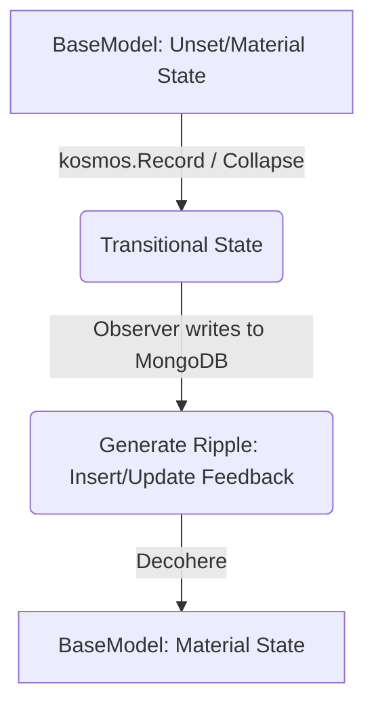

# Kosmos-Go

**Kosmos-Go** is a Go-based framework and data persistence layer built around MongoDB. It wraps the official MongoDB Go driver (`go.mongodb.org/mongo-driver/v2`).

---

## The Microcosm Philosophy

The naming strategy in `kosmos-go` treats the database as the foundational space (the *reality*) in which the application exists. It model entity materialization as follow:

- **Collapse / Collapsible**: The transition of an entity from an ephemeral state to empirical reality. When an entity is collapsed, its ID is resolved, timestamps are established, and configurations are evaluated.
- **Record**: The act of measuring and writing an entity's state into database reality. An Observer interacts with MongoDB. To "Witness" (using `kosmos.Record`) is to commit and persist a specific state.
- **Ripple**: Causal side-effects extending outwards from an event. It tracks operations that happen alongside a collapse (e.g., MongoDB `$setOnInsert` operations for creation timestamps, `$inc`, or `$addToSet`).
- **Entangled**: A state of being linked to database reality (i.e., whether an entity has been persisted and assigned a valid database ID).
- **Summon**: Materializing or calling forth a manager, connection, or client singleton (e.g., `SummonSecretManager()`, `SummonMongo()`).
- **Coalesce**: Merging configuration sources, command-line arguments, and environment variables into a single authoritative source of truth.
- **Ether**: The ambient layer that handles environment configuration, connection strings, and GCP Secret Manager integrations.
- **Detectable**: The interface representing an entity that can be matched, filtered, sorted, or grouped.

---

## Architecture & Packages

### `kosmos`
The main entry-point package exposing high-level initialization, persistence, and queries:
* **`Ignite(cmdSource, source...)` / `IgniteBase(...)`**: Bootstraps the application, loads configuration via the `ether` package, retrieves secrets, and initializes the MongoDB client.
* **`BaseModel`**: The core struct that must be embedded in your data models. It manages the `ID`, `CreatedTime`, `UpdatedTime`, and state transitions (`Unset`, `Transition`, `Material`).
* **`Record(ctx, obj)`**: The primary persistence function. It triggers `Collapse()`, writes the object to MongoDB (using `upsert: true`), and resolves the state back onto the struct via `Decohere()`.
* **`Detect[T](filters...)`**: Starts a query/match pipeline for the specified filters.

### `matter`
The database interaction layer:
* **`Observer`**: Responsible for executing the MongoDB write/upsert pipelines.
* **`Detector`**: Implements MongoDB aggregation stages (`$match`, `$sort`, `$limit`, `$group`) in a type-safe, fluent pipeline.
* **`Projector`**: Projects fields into new result shapes using aggregation pipelines.
* **`MongoDataverse`**: Coordinates client connections and purpose affinity pools (e.g., `Admin`, `Creator`, `Observer`).

### `ether`
The environment configuration and secret management subsystem. Integrates with Google Secret Manager, `viper`, and `cobra` to load and decrypt connection strings/credentials.

---

## Database Lifecycle: Collapse & Decohere

Every write to MongoDB follows a strict, two-phase lifecycle:



1. **Collapse**: The entity transitions from potential to actual state. An ID is generated (if missing), and fields like `created_time` and `updated_time` are staged inside a `Ripple` (using `$setOnInsert` for creation).
2. **Persistence**: The `Observer` performs an upsert.
3. **Decohere**: The database feedback is read back into the struct. The struct transitions back to a stable state (`Material`), updating `CreatedTime` and `UpdatedTime` based on the database response.

---

## Getting Started

### 1. Initialize the Kosmos
First, boot the environment. This loads secrets, parses environment variables, and connects to the database.

```go
package main

import (
	"context"
	"log"

	"github.com/borghives/kosmos-go"
)

func main() {
	// Initialize the environment (using test.env as a config source)
	kosmos.Ignite(nil, "test.env")
}
```

### 2. Define your Model
Create a struct representing your collection. Embed `kosmos.BaseModel` as the first field and use the `kosmos` tag to specify the collection (and optional branch/database namespace).

```go
type User struct {
	kosmos.BaseModel `bson:",inline" kosmos:"users"`
	Name             string `bson:"name"`
	Email            string `bson:"email"`
	Age              int    `bson:"age"`
}
```

---

## Code Examples

### A. Saving a Record (Upsert / Record)
To insert or update a record, use `kosmos.Record`. This automatically executes the entire Collapse/Decohere cycle.

```go
ctx := context.Background()

user := &User{
	Name:  "Jane Doe",
	Email: "jane.doe@example.com",
	Age:   30,
}

// Persist the user (performs an upsert under the hood)
err := kosmos.Record(ctx, user)
if err != nil {
	log.Fatalf("failed to persist user: %v", err)
}

// BaseModel fields are automatically populated after decoherence
fmt.Printf("User ID: %s\n", user.ID.Hex())
fmt.Printf("Created: %v\n", user.CreatedTime)
fmt.Printf("Updated: %v\n", user.UpdatedTime)
```

### B. Querying (Detect & Pull)
Queries are executed using `kosmos.Detect` or `kosmos.All`. Field references are typed and constructed via `kosmos.Fld(...)`. Field names in query expressions are normalized automatically to match their corresponding BSON keys.

```go
// 1. Pull a single record
userRecord, err := kosmos.Detect[User](
	kosmos.Fld("email").Eq("jane.doe@example.com"),
).PullOne(ctx)

if err != nil {
	log.Fatalf("query failed: %v", err)
}
if userRecord != nil {
	fmt.Printf("Found user: %s (Age: %d)\n", userRecord.Name, userRecord.Age)
}

// 2. Query multiple records with filters, sorting, and limit
users, err := kosmos.Detect[User](
	kosmos.Fld("age").Gte(18),
).Sort("name", false).Limit(10).PullAll(ctx)

if err != nil {
	log.Fatalf("failed to retrieve users: %v", err)
}
for _, u := range users {
	fmt.Println(u.Name)
}
```

### C. Aggregations (GroupBy & Accumulate)
You can group records and accumulate counts or sums using MongoDB aggregation pipelines natively wrapped in Go.

```go
// Target struct to project aggregation results into.
// Note: It must embed kosmos.BaseModel to satisfy the Detectable constraint.
type UserAgeGroup struct {
	kosmos.BaseModel `bson:",inline"`
	Age              int `bson:"age"`
	Count            int `bson:"count"`
}

// Project grouped aggregations into the target struct
ageStats, err := kosmos.ProjectInto[UserAgeGroup](
	kosmos.Fld("age").With().GroupKey("age"),
	kosmos.Fld("count").With().Field("count"),
).From(
	kosmos.Detect[User](
		kosmos.Fld("age").Gte(21),
	).GroupBy(
		"age",
	).Accumulate(
		kosmos.Fld("count").With().Sum(1),
	),
).PullAll(ctx)

if err != nil {
	log.Fatalf("aggregation failed: %v", err)
}

for _, stat := range ageStats {
	fmt.Printf("Age %d: %d users\n", stat.Age, stat.Count)
}
```